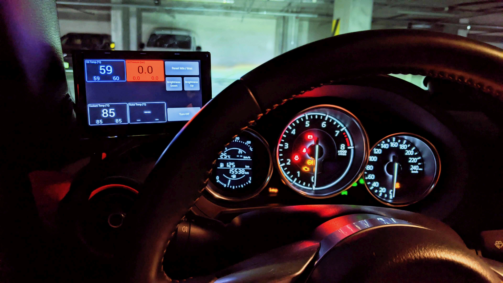

# KnurDash - DIY Racing Data Logger with [RaceChrono](https://racechrono.com/) Integration

    

## Description

The aim of this project was to build a racing logger for my ND2 Mazda MX-5 and integrate the following functionality into one unit:

- Read analog sensors (oil pressure and temperature, rotor temperature)
- Read CANBUS data (coolant and intake temperature, RPM, etc.)
- Display data in a clear and aesthetically pleasing way
- Make data available via Bluetooth as [RaceChrono DIY BLE device](https://github.com/aollin/racechrono-ble-diy-device)

---

## Technical Details

The system has two main components, the display unit and the sensor unit. The communication between the two is executed through I2C protocol (1.2m cable is pushing it though. With careful cable prep I still get ~0.5% error rate on comms.). The display unit is made of a Raspberry Pi 4B board and a [4.3 inch touchscreen](https://www.waveshare.com/4.3inch-dsi-lcd-with-case.htm). The sensor unit houses a [5V power supply](https://www.pololu.com/product/3782/specs), two [4-channel ADC's](https://www.dfrobot.com/index.php?route=product/product&product_id=1182&search=DFR0316), a [motion tracking device](https://www.dfrobot.com/index.php?route=product/product&product_id=880), and a [Longan Labs I2C CAN Controller](https://docs.longan-labs.cc/1030017/) with a [custom firmware](https://github.com/chrumck/I2C_CAN_Firmware) built specifically for this project.

Additionally, the sensor unit contains circuitry [(LTSpice schematic)](./LTSpice/PowerOffCircuit.asc) allowing starting the system when the vehicle's START button is pressed. This has been accomplished by pulling RPI's GLOBAL_EN to ground when RPI is off. When RPI is running and [3.3V is on](https://www.raspberrypi.com/documentation/computers/raspberry-pi.html#POWER_OFF_ON_HALT), the starting circuit is disabled to prevent hard resets while RPI system and the OS is running.

Bluetooth communication was implemented using the [bluez_inc](https://github.com/weliem/bluez_inc) library (kudos to [weliem](https://github.com/weliem) for making my life easier!). The system implements the [RaceChrono BLE DIY](https://github.com/aollin/racechrono-ble-diy-device) protocol. The system works as a pass-through for selected CAN frames. Additionally, all analog data collected by the unit is exposed as an additional CAN frame and made available to RaceChrono for logging.

The display unit has a buzzer installed. The buzzer is turned on when the oil pressure drops below a certain threshold and the RPM is above idling.

The rotor temperature is measured with an industrial grade 0~1000 degC infrared pyrometer with a 4-20mA output.

As of 2023-09-04, the system is installed in the car and in initial testing . The transmission, differential, and rotor temperature sensors were not installed yet, but coming soon!

Future development:

- Read motion tracking data from the already installed unit and expose it to RaceChrono
- Add a [differential GPS](https://www.sparkfun.com/products/15136) board

---

## Pictures

### Display Unit

 

    
 

 

    
 

### Sensor Unit

    
 

    
 

 

    
 

 

    
 

